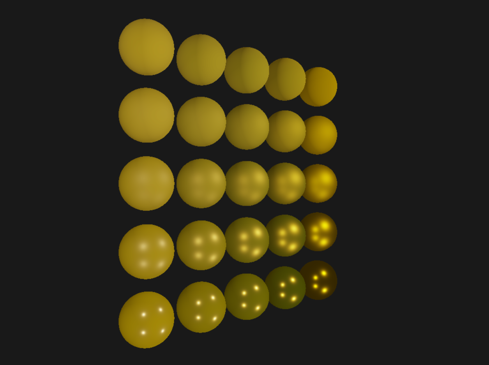

# RenderWidgetWithVulkan

## 简介

一个简易的Vulkan渲染框架，用于实现各种渲染算法的验证demo。 

## 环境配置

本项目在Windows上运行

- 安装Vulkan
    在[LunarG](https://vulkan.lunarg.com/)上下载Vulkan，并按照[Vulkan Toturial](https://vulkan-tutorial.com/Development_environment#page_Vulkan-SDK)中的要求安装Vulkan SDK，确保安装成功

- 在git中执行如下命令获取代码：
  
  ```powershell
  git clone --recursive https://github.com/xiaodoubao22/RenderWidgetWithVulkan.git
  ```

- 构建VS工程
  
  运行scripts/build_sln.bat脚本构建Visual Studio工程，这里用的版本是VS2022，若版本不符合可修改build_sln.bat脚本或重新安装Visual Studio。

- 编译shader
  
  运行scripts/build_sln.bat脚本将Shader源代码编译为.spv文件。

- 打开Visual Studio编译并运行。

## 运行效果




